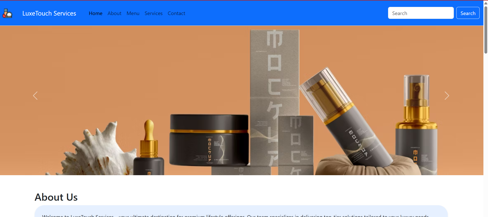
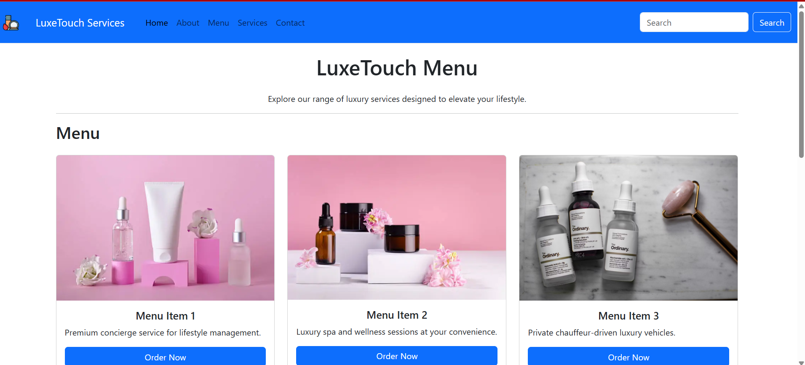
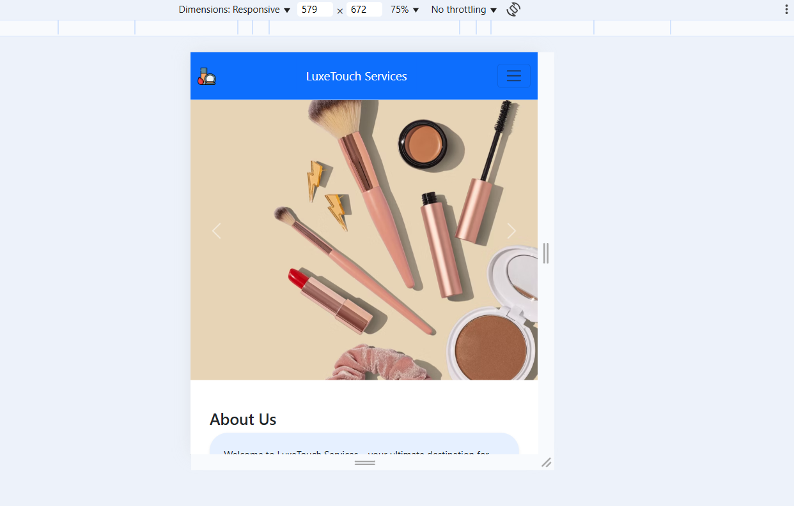

# Cosmetic-Products-and-services-E-commerce-Application-
This is a responsive multi-page website built using Bootstrap 5. It features a dynamic navbar, carousel, service cards, and a luxury service menu layout. The design ensures mobile-friendliness and a clean, professional user experience.

# LuxeTouch Services Website

A responsive and elegant multi-page website for luxury service offerings, built using **Bootstrap 5**.

## 🛠️ Project Features

- Responsive navbar with smooth navigation.
- Full-width carousel showcasing service visuals.
- Service section with Bootstrap cards.
- Menu page displaying premium offerings.
- Contact form with validation-ready fields.
- Clean layout and mobile-friendly design.

## 📸 Screenshots

### 🔹 Home Page



### 🔹 Menu Page



### 🔹 Responsive View



> Replace the image paths (`screenshots/*.png`) with your own screenshots saved in a `screenshots/` folder.

## 🚀 Technologies Used

- HTML5 & CSS3
- Bootstrap 5
- JavaScript (for dynamic navbar loading)
- Responsive Design Principles

## 📂 File Structure
```
project-folder/
├── index.html
├── menu.html
├── navbar.html
├── img/
│ ├── icon.png
│ ├── image1.png to image6.png
│ ├── menu1.png to menu9.png
│ └── service1.png to service9.png
├── screenshots/
│ ├── homepage.png
│ ├── menu.png
│ └── mobile-view.png
└── README.md

```
## 💡 How to Use

1. Clone or download the project.
  ```
https://github.com/Yadhavaramanan/Cosmetic-Products-and-services-E-commerce-Application.git
```
2. Open with a Live Server (e.g., VS Code Live Server).
3. Make sure all images are placed correctly inside the `img/`folder.

## 📃 License

This project is open for educational and demo use. Customize freely for your own portfolio or learning purposes.

---

